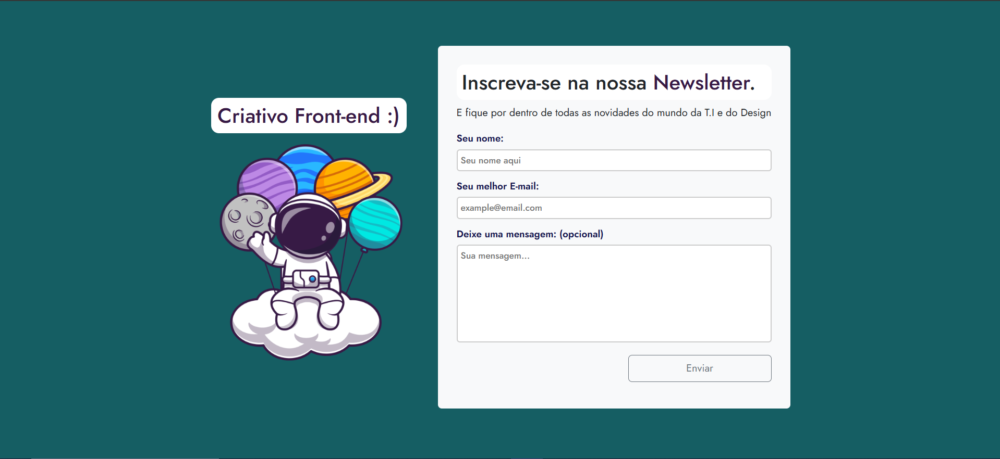

# 🗃 Landing Page com Formulário de Cadastro para Newsletter 🗃




Este projeto consiste em uma **Landing Page** funcional que permite aos usuários cadastrarem seus e-mails para receberem newsletters.  
O sistema foi desenvolvido utilizando tecnologias modernas no front-end para proporcionar uma experiência agradável e eficiente. Pode ser feito a integração com algum back-end que já reconheça o e-mail e ative ele numa lista de disparos de e-mails para **newsletter**.
```
landing-page-newsletter/
├── img/
│   └── astronauta.png      # Imagem
├── node_modules/
├── image-preview.png       # Preview da página
├── index.html              # Página inicial
├── package-lock.json       # Config do Bootstrap
├── package.json            # Config do Bootstrap
├── script.js               # Lógica de envio de e-mails
├── style.css               # Estilização da página
└── README.md               # Documentação do projeto VOCÊ ESTÁ AQUI :)
```

## 🛠️ Tecnologias Utilizadas 🛠️

### **Front-end**
- **HTML5**: Estruturação da página.
- **CSS3**: Estilização personalizada.
- **Bootstrap**: Layout responsivo e componentes pré-construídos.

### **Back-end**
##### **recomenda-se utilizar para o processamento de formulários e envio de e-mails.**
- **PHP** com a biblioteca de dependência Composer
- **NodeJs**:

## 📋 Funcionalidades 📋

1. **Formulário de Cadastro**:
   - Campo para inserção do nome.
   - Campo para inserção do e-mail.
   - Campo para inserção de mensagem.
   
2. **Envio de E-mail**:
   - O envio utiliza-se a versão de teste do **EmailJs**.

3. **Design Responsivo**:
   - A partir do **Bootstrap**, o design fica compatível com dispositivos móveis e desktops.

---

## ⚙️ Como Executar o Projeto ⚙️

### Pré-requisitos
- Ter uma conta no Email.js.
- Vs Code.

```
emailjs.init("PUBLIC KEY_");

//Assim que criar a conta, use a sua PUBLIC KEY_

//Na function, substitua o SERVICE_ID e o TEMPLATE_ID

//O SERVICE_ID, vai em E-mail Services, clica no seu e-mail cadastrado e procura o campo referente.
//O TEMPLATE_ID, vai em E-mail Templates, clica no seu template criado e procura o campo referente.

 emailjs.send("SERVICE_ID", "TEMPLATE_ID", {
        to_email: to,
        subject: subject,
        message: message
    })

```

## 🚀 Próximos Passos 🚀

Armazenar e-mails em um banco de dados (opcional, usando MySQL).
Implementar testes unitários no envio de e-mails de forma paga.

## 🤝 Contribuições 🤝
- Contribuições são sempre **bem-vindas**!
- Sinta-se à vontade para abrir issues ou enviar um pull request. Assim que fizer o pull, **certifique-se que colocou os arquivos alterados em uma pastinha separada com seu nome**, para ficar de forma organizada e outros desenvolvedores escolher qual tipo de ideia utilizar. :)

```
//Exemplo

landing-page-newsletter/
├── img/
│   └── astronauta.png      # Imagem
├── node_modules/
├── image-preview.png       # Preview da página
├── index.html              # Página inicial
├── package-lock.json       # Config do Bootstrap
├── package.json            # Config do Bootstrap
├── script.js               # Lógica de envio de e-mails
├── style.css               # Estilização da página
└── README.md               # Documentação do projeto VOCÊ ESTÁ AQUI :)
└── JoaoBR123/              #Alteração feita pelo usuário JoaoBR123
├──── img/
│   │  └── astronauta.png      # Imagem
|   ├── node_modules/
|   ├── image-preview.png       # Preview da página
|   ├── index.html              # Página inicial
|   ├── package-lock.json       # Config do Bootstrap
|   ├── package.json            # Config do Bootstrap
|   ├── script.js               # Lógica de envio de e-mails
|   ├── style.css               # Estilização da página
|   └── README.md               # Documentação do projeto (DESCREVA O QUE VOCÊ ALTEROU PARA QUE O PRÓXIMO DESENVOLVEDOR SABER O QUE PODE UTILIZAR EM UM PROJETO)
```
## Se precisar de ajuda com algum ponto específico ou alteração, é só entrar em contato comigo! 😊

[](https://www.linkedin.com/in/felipe-silva-a9a008201/)

1. Clone este repositório:
   ```
   
   ```
   